# GO-Steel MagSim — 取向硅钢微磁仿真与机器学习代理模型平台

<p align="center">
  
  
  
  
  
  
</p>

> **English abstract:** A full-stack research platform for grain-oriented (GO) silicon steel.  
> It integrates ODF texture generation → MuMax3 micromagnetic simulation → polycrystalline B-H aggregation → ML surrogate model training → ANSYS Maxwell `.amat` export and BH curve analysis report, all from a single Flask web UI.

---

## 目录 / Contents

- [研究背景](#研究背景)
- [系统架构](#系统架构)
- [主要功能](#主要功能)
- [快速开始](#快速开始)
- [模块说明](#模块说明)
- [数据说明](#数据说明)
- [API 接口](#api-接口)
- [参考材料数据库](#参考材料数据库)
- [文件结构](#文件结构)
- [License](#license)

---

## 研究背景

取向硅钢（Grain-Oriented Silicon Steel, GO Steel）是变压器铁芯的核心磁性材料，其磁各向异性由 **Goss 织构 {110}⟨001⟩** 主导。传统磁性能表征依赖物理实验，成本高、周期长，难以覆盖连续织构参数空间。

本平台构建了一条**从 ODF 织构参数到角度相关 B-H 曲线的完整数值仿真 + 机器学习代理模型工作流**，将一次 B-H 曲线预测的时间从小时级（MuMax3）压缩至**毫秒级**（ML 推断），同时保留对 ANSYS Maxwell 的直接导出能力。

---

## 物理建模说明（"特征晶体"代理模型）

### 仿真的实际物理含义

本平台的 MuMax3 仿真采用**单磁畴静态能量最小化**方法（`minimize()` 准静态求解器）。

**每一次 MuMax3 计算代表的是**：具有特定晶体学取向的**理想单晶参考体**（以下简称"特征晶体"）在准静态磁场下的能量最小化磁化响应。这不是对真实取向硅钢薄片微观结构的直接仿真，而是对**单一晶粒晶体学取向贡献**的理论计算。

```
仿真对象:  理想单晶特征晶体 (无畴壁, 无缺陷, 相干旋转)
物理过程:  Stoner-Wohlfarth 能量最小化
物理意义:  该取向的"非滞后磁化曲线" (可逆磁化分量)
```

**多晶聚合**：ODF 织构参数定义的取向概率分布，通过对 N 个特征晶体的加权平均，得到**织构贡献的宏观 B-H 曲线**。这等价于晶体塑性力学中的 Taylor-Sachs 晶粒平均方法。

### 模型适用范围与已知局限

| 物理量 | 本模型建模质量 | 实际物理机制 | 说明 |
|--------|--------------|------------|------|
| **饱和磁感应强度 Bsat** | ✅ 较准确 | 由 μ₀Msat 决定 | 取决于材料参数精度 (Fe-3%Si: ≈2.0T) |
| **高场磁导率 μr (H > 2000 A/m)** | ✅ 定性正确 | 织构各向异性控制 | RD/TD 差异规律可靠 |
| **B800 / B1000 工程指标** | ⚠️ 系统性偏低 | 多机制叠加 | 通过参考锚点校正可改善 |
| **初始磁导率 μ_init** | ⚠️ 失真 | 畴壁可逆弯曲决定 | 不在本模型物理范围内 |
| **矫顽力 Hc** | ❌ 严重失真 | 实测 < 10 A/m，仿真 ≈ 700 A/m | 70× 误差，根本机制不同 |
| **磁滞回线形状** | ❌ 过于矩形 | 由畴壁钉扎-去钉扎决定 | 定性错误，不可用 |
| **铁损 W/kg** | ❌ 不可直接预测 | 高频涡流 + 畴壁损耗 | 通过 Bertotti 参数估算，非仿真直接输出 |

### 矫顽力差异的根本原因

取向硅钢矫顽力极低（**Hc < 10 A/m** for B23R075 等优质牌号）的物理根因是**畴壁运动机制**：

```
实际机制 (Hc < 10 A/m):
  磁化反转 = 极少量的 180° 畴壁 在 Goss 晶粒内缓慢移动
  能垒 ≈ 钉扎能 (晶格缺陷、夹杂物) → 极小
  Hc ∝ 钉扎场 << 各向异性场 H_k

本仿真 (Hc ≈ 700 A/m):
  磁化反转 = 所有磁矩相干旋转 (Stoner-Wohlfarth)
  能垒 = 各向异性能 K1 → 较大
  Hc ∝ H_k × f(θ) = (2K1/μ₀Msat) × f(θ) ≈ 数百 A/m
```

**为什么无法在合理时间内修正**：

畴壁仿真要求晶粒几何尺寸 ≫ 畴壁宽度 δ_w。对 Fe-3%Si：

```
δ_w = π√(A/K1) = π√(2.1×10⁻¹¹ / 3.6×10⁴) ≈ 75 nm

可信仿真最小晶粒尺寸 ≥ 5×δ_w ≈ 375 nm
所需网格（4nm cell）: 94×94×94 ≈ 830,000 cells
RTX 2060 估算时间: > 8 小时/晶粒
```

当前设置（4×4×1 = 16 cells，16nm 晶粒）比畴壁宽度（75nm）**小 4.7 倍**，物理上无法支持畴壁存在。

### 正确使用方式

基于以上分析，本平台的仿真结果应作如下使用：

1. **用于预测的量**: B-H 曲线的**高场部分**（H > 2000 A/m），各向异性比（B_RD/B_TD），以及不同 ODF 参数间的**相对差异趋势**
2. **不用于预测的量**: 矫顽力、剩磁、磁滞回线面积（铁损）、B-H 曲线膝部以下的精确值
3. **Hc 和磁滞特性来源**: 使用 `go_steel_data/` 参考材料数据库中的实测值，不从仿真读取
4. **系统误差修正**: 使用锚点标定（见 `docs/material_mapping_strategy.md`）将绝对值向参考材料校准

---

## 系统架构

```mermaid
graph LR
    A["ODF 参数\n(φ, σ, f_Goss…)"] -->|odf_texture.py| B["晶粒取向集合\nN=200~2000 grain"]
    B -->|mx3_generator.py| C["MuMax3 脚本\n(.mx3)"]
    C -->|MuMax3 GPU| D["磁化场 OVF\n时序输出"]
    D -->|bh_extractor.py| E["单晶粒 BH 点"]
    E -->|pipeline_runner.py| F["多晶聚合 BH 曲线\nRD / TD / θ°"]
    F -->|physics_calibrator.py| G["物理校准\nB₀ 归一化 · 单调性"]
    G -->|dataset_builder.py| H["特征数据集\n(CSV)"]
    H -->|ml_trainer.py| I["代理模型\nXGBoost / ExtraTrees"]
    I -->|Web UI 预测| J["B-H 预测曲线\n⚡ ms级"]
    J -->|maxwell_exporter.py| K[".amat (AEDT 格式)"]
    J -->|bh_curve_analyzer.py| L["BH 分析报告\n3张对比图 + 指标"]
    K --> M["ANSYS Maxwell\n电磁仿真"]
```



---

## 主要功能

| 模块 | 功能 |
|------|------|
| **ODF 织构生成** | 基于 Goss 峰 + 均匀背景生成 N 个随机晶粒取向，支持 σ（散布角）参数控制 |
| **MuMax3 批量调度** | 自动生成 `.mx3` 脚本，支持批量 GPU 任务调度，断点续跑 |
| **多晶 BH 聚合** | 从 OVF 文件提取单晶粒 B-H 点，加权平均到材料级别，支持 0°~180° |
| **物理约束校准** | 消除数值伪差（初始非单调、B₀ 漂移），对齐工程坐标系 |
| **ML 代理模型** | XGBoost + ExtraTrees 双模型，5折交叉验证，ms 级推断 |
| **快速预测 Web UI** | 浏览器端实时调参 → 即时 B-H 曲线 → 与历史结果对比 |
| **Maxwell 导出** | 输出 AEDT `$begin` 格式 `.amat`，含各向异性 μr（RD/TD/ND）+ 铁损系数 |
| **BH 分析报告** | 3张对比图（全等级 BH、RD 分析、TD 各向异性）+ Bertotti 铁损参数 |
| **材料代表性分析** | 多角度仿真结果的分组统计、ODF 传递矩阵可视化 |
| **自选对比材料** | 可选取 go_steel_data 参考等级 + 历史仿真导出，定制对比图 |

---

## 快速开始

### 环境要求

- Python 3.10+
- MuMax3 3.10（仅仿真调度模块需要，预测模块不需要）
- CUDA 兼容 GPU（MuMax3 仿真，可选）

### 安装依赖

```bash
git clone https://github.com/ZWXYM/go-steel-magsim.git
cd go-steel-magsim
pip install -r requirements.txt
```

`requirements.txt` 主要依赖：

```
flask
numpy
scipy
matplotlib
scikit-learn
xgboost
joblib
```

### 启动 Web UI

```bash
python app.py
```

浏览器访问 `http://127.0.0.1:5000`

### 初始化数据目录

首次运行时，系统自动创建以下目录（如不存在）：

```
data/
  exports/      ← .amat 导出文件
  datasets/     ← ML 训练数据集（gitignored）
  models/       ← 训练好的模型（gitignored）
```

---

## 模块说明

```
modules/
├── odf_texture.py          ODF 织构采样（Goss + 均匀背景，von Mises / Bunge 参数化）
├── mx3_generator.py        MuMax3 .mx3 脚本生成器（PBC 边界、交换耦合、各向异性 Ku）
├── bh_extractor.py         OVF → B-H 点提取器（FFT 降噪 + 磁化投影）
├── pipeline_runner.py      批量仿真调度 + 多晶 BH 聚合器
├── physics_calibrator.py   物理约束校准（单调化、B₀ 归一化）
├── dataset_builder.py      特征工程 + 训练集 CSV 生成
├── ml_trainer.py           XGBoost / ExtraTrees 训练、评估、保存
├── maxwell_exporter.py     AEDT .amat 生成（各向异性 + Bertotti 系数）
├── bh_curve_analyzer.py    BH 曲线对比分析（PCHIP + NNLS，3 张 matplotlib 图）
├── batch_scheduler.py      GPU 任务队列调度器
└── anisotropy_interpolator.py  角度相关 μr 插值
```

---

## 数据说明

### go_steel_data/output/

包含 **10 个宝钢 / IEC 标准 GO 硅钢等级**的参考 `.amat` 文件（B-H 曲线 + 铁损数据），用于与仿真结果对比：

| 等级 | B₈₀₀ RD (T) | P₁₅/₅₀ (W/kg) | P₁₇/₅₀ (W/kg) |
|------|------------|--------------|--------------|
| GO_Steel_23QG090 | ~1.88 | 0.90 | — |
| GO_Steel_27QG095 | ~1.87 | 0.95 | — |
| GO_Steel_27QG100 | ~1.86 | 1.00 | — |
| GO_Steel_30QG105 | ~1.85 | 1.05 | — |
| GO_Steel_30QG120 | ~1.83 | 1.20 | — |
| GO_Steel_35QG155 | ~1.80 | 1.55 | — |
| GO_Steel_IEC_M080_23P | ~1.90 | 0.80 | — |
| GO_Steel_IEC_M089_27P | ~1.88 | 0.89 | — |
| GO_Steel_IEC_M111_30P | ~1.86 | 1.11 | — |
| GO_Steel_IEC_M140_35P | ~1.83 | 1.40 | — |

> 铁损数据用于 Bertotti 三分量模型（Kh/Kc/Ke）的 NNLS 拟合。

### .amat 格式（AEDT $begin 格式）

```
$begin 'GO_Sim_20250101'
    'CoordinateSystemType'='Cartesian'
    $begin 'permeability'
        'property_type'='AnisoProperty'
        $begin 'component1'        # RD 方向 μr
            $begin 'BHCoordinates'
                Points[N: 0,0, H1,B1, H2,B2, ...]
            $end 'BHCoordinates'
        $end 'component1'
        $begin 'component2'        # TD 方向 μr
            ...
        $end 'component2'
        'component3'='1000'        # ND 方向 μr（各向同性近似）
    $end 'permeability'
    'core_loss_kh'='8.500000e-04'
    'core_loss_kc'='2.467146e-05'
    'core_loss_ke'='0.000000e+00'
    'core_loss_equiv_cut_depth'='0.00035meter'
    'mass_density'='7650'
$end 'GO_Sim_20250101'
```

---

## API 接口

| 方法 | 路径 | 说明 |
|------|------|------|
| GET | `/api/status` | 系统状态（模型加载、数据集统计） |
| POST | `/api/predict` | 快速 B-H 预测（输入 ODF 参数） |
| POST | `/api/analyze/material` | 材料代表性分析（多角度仿真聚合） |
| POST | `/api/analyze/export-bh-analysis` | 导出 `.amat` + 生成 BH 对比分析报告 |
| GET | `/api/bh-analysis/reference-list` | 获取可选对比材料列表（参考等级 + 历史仿真） |
| GET | `/api/exports/list` | 历史导出 `.amat` 列表 |
| POST | `/api/train` | 触发 ML 模型训练 |
| GET | `/data/exports/<filename>` | 下载导出文件 |

---

## 参考材料数据库

`bh_curve_analyzer.py` 内置 Bertotti 损耗参数数据（`LOSS_POINTS`），来源为宝钢产品手册与 IEC 60404-8-7。计算方法：

- **Kc（古典涡流）**：`π²·σ·d²/(6·ρm)`，d=板厚，σ=电导率，ρm=质量密度
- **Kh、Ke（磁滞 + 超量）**：NNLS 拟合 P₁₅/₅₀ 和 P₁₇/₅₀ 两个测量点

> ⚠️ 正常 B-H 曲线（单调磁化）无法确定剩磁 Br 和矫顽力 Hc，后者需要完整磁滞回线。

---

## 文件结构

```
.
├── app.py                          Flask 主程序
├── requirements.txt
├── templates/
│   └── index.html                  单页 Web UI（Chart.js + 原生 JS）
├── modules/                        核心功能模块
│   ├── odf_texture.py
│   ├── mx3_generator.py
│   ├── bh_extractor.py
│   ├── pipeline_runner.py
│   ├── physics_calibrator.py
│   ├── dataset_builder.py
│   ├── ml_trainer.py
│   ├── maxwell_exporter.py
│   ├── bh_curve_analyzer.py
│   ├── anisotropy_interpolator.py
│   └── batch_scheduler.py
├── go_steel_data/
│   ├── output/                     宝钢/IEC 参考等级 .amat（10 个等级）
│   └── *.py                        数据生成脚本
├── docs/                           设计文档
│   ├── anisotropic_interpolation_workflow.md
│   ├── paper_grade_training_protocol.md
│   └── physics_constraint_calibration.md
├── data/                           运行时数据（gitignored）
│   ├── exports/                    .amat 导出
│   ├── datasets/                   ML 训练集
│   └── models/                     训练好的模型
└── scripts/                        批处理脚本占位
```

---

## License

MIT License — 学术研究与非商业用途。引用请注明出处。

```
@misc{go-steel-magsim-2025,
  title  = {GO-Steel MagSim: A Micromagnetic Simulation and ML Surrogate Platform for GO Silicon Steel},
  author = {YUCE},
  year   = {2025},
  url    = {https://github.com/ZWXYM/go-steel-magsim}
}
```
