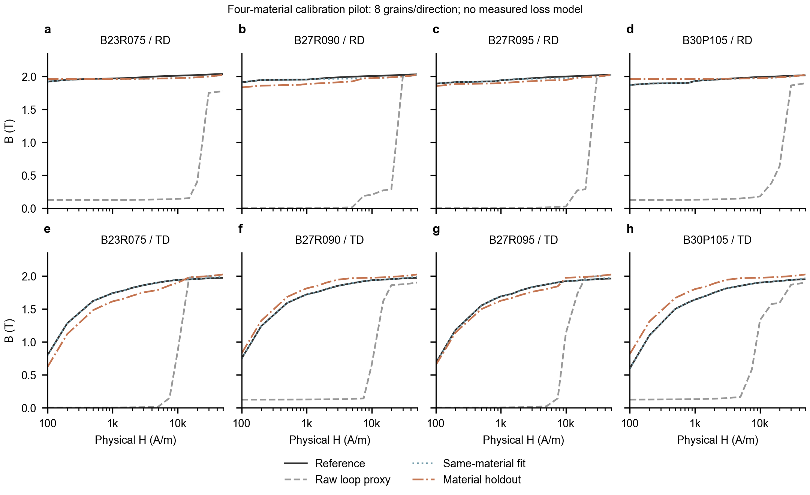
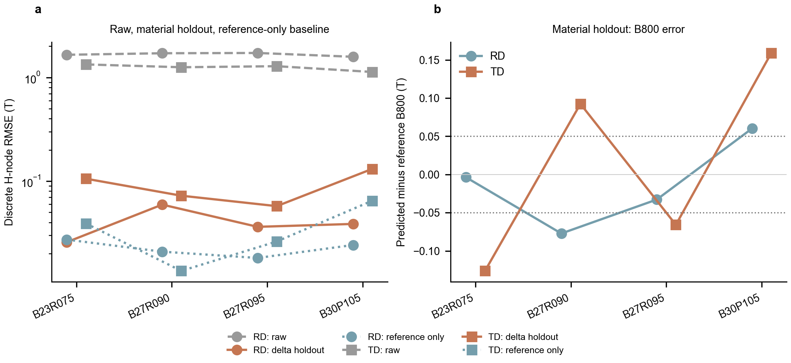

# 2026-10-03 校准工程推进记录

已完成迁移后的第一轮实质推进：修正仿真物理设置，建立固定物理 H 的校准接口，完成四牌号、双方向、各 8 晶粒的 64 个本机 GPU 仿真，并建立逐牌号独立留出评估。原源目录/快照/旧模型和电机求解文件保留。

本轮结果是工程试验；没有宣称最终实验校准已完成。摘要：原始平均 RMSE **1.46051 T**，同牌号拟合平均 RMSE **0.01074 T**，独立牌号留出平均 RMSE **0.06581 T**；留出 B800 最大绝对误差 **0.15906 T**。八个材料/方向是否全部满足 0.05 T 目标：**False**。

## 已修复的实际问题

1. 旧脚本写“立方各向异性”却设置 MuMax3 单轴参数 Ku1；新版使用 Kc1/Kc2、Ku1=0 和明确 anisC1/anisC2。官方依据：[MuMax3 3.11.1 API](https://mumax.github.io/api3111.html)。原生能量探针在 <100>/<110>/<111> 得到 0、4.6080006e-21、6.144002e-21 J，与解析值一致。
2. 薄片几何固定却只旋转外场造成坐标不一致。新版几何/场均在样品坐标系，旋转晶体各向异性轴；RD=(1,0,0)、TD=(0,1,0)。RVE 文档更正为默认 16×16×1 nm，删除没有依据的“微米级/降低交换/性能保证”文字。
3. 多角度模式原数组字面量被本机 MuMax3 拒绝；改为明确逐角度脚本，原生两角度执行得到 24 行/12 列（诊断 n_steps=2），angle_deg 区分回线。
4. 旧修正入口直接查询参考曲线，重新写 δ 缓存不进入该链。新增显式 calibration_path 分支及 CalibrationBank，实际读取 bank；替换 bank 的端到端测试证明下一次结果改变。
5. 新协议不缩放 H：训练诊断、预测 JSON、图、.amat 使用同一 H_A_per_m。旧保存模型保留历史行为，未伪装成新版校准。
6. 数据集增加 physics/correction/H-axis 标识；普通和论文级训练器拒绝混用版本，并记录 dataset SHA256。四行同牌号拟合诊断不能进入正式代理训练。

## 试验设计和结果

牌号参数取登记表的报告列：B23R075(0.91,3°,5°,Si3.1)、B27R090(0.87,4°,6°,Si3.1)、B27R095(0.84,5°,7°,Si3.1)、B30P105(0.79,6°,8°,Si3.0)。Si 是报告标称 wt%，ODF 是估计，不替代同批次证书/EBSD。

全大回线显式标注下降/上升分支；两支中点经过 J=B−μ0H 非负/单调/饱和约束，按 8 个等体积晶粒求均值，保留逐晶粒值与标准差。这个量是工程代理，并不是标准去磁初始/正常曲线。Kc1(Si)、Msat 和交换仍为原模型先验，未验证成分因果响应。

固定 H 计算每牌号 δ=B_reference−B_raw，用预先规定的 ODF/Si 距离做 IDW 插值。每个留出 bank 的 JSON 物理删除目标牌号全部 RD/TD 锚点，禁止用它的参考曲线参与预测；参考仅用于误差评估。同牌号拟合误差单独列出。

| 留出牌号 | 方向 | RMSE T | B800 误差 T | B1000 误差 T | 超出训练特征包围盒 |
|---|---|---:|---:|---:|---|
| B23R075 | RD | 0.02579 | -0.00365 | -0.00539 | True |
| B23R075 | TD | 0.10559 | -0.12627 | -0.12635 | True |
| B27R090 | RD | 0.05936 | -0.07728 | -0.06859 | False |
| B27R090 | TD | 0.07235 | +0.09242 | +0.09209 | False |
| B27R095 | RD | 0.03624 | -0.03285 | -0.04107 | False |
| B27R095 | TD | 0.05738 | -0.06591 | -0.06583 | False |
| B30P105 | RD | 0.03865 | +0.06036 | +0.03185 | True |
| B30P105 | TD | 0.13114 | +0.15906 | +0.15999 | True |

RMSE 对 H≥100 A/m 的规定非均匀网格节点等权计算，不是均匀连续 H 积分。其余 MAE、低场/高场误差、全曲线值见 CSV。当前只检测逐维特征包围盒；盒外为外推，盒内也不保证在实际训练凸包内。单 seed、n=8 尚无收敛证据；同牌号拟合即使有较小误差也不能升级为泛化结论。

64 个任务均 exit=0，累计原生求解耗时约 20.7 分钟。每个 script/table 及冻结参考均登记 SHA256；分析时再次核验。错误数组语法的首轮试验保留在 diagnostics，仅用于调试，不计入成功仿真样本。

另加一个不含 MuMax 原始差异的对照：使用完全相同的留出权重，只插值其余牌号参考曲线。此“参考曲线内插基线”平均 RMSE **0.02925 T**，B800 最大绝对误差 **0.07450 T**，仍未全部满足 0.05 T。它比差分校准误差小，提示八晶粒原始残差转移/参考—ODF 映射有待改进；该对照不是微磁预测，不能用来包装代理精度。结果同时保存在误差 CSV 和辅助误差图。

## 交付与验证

- `calibration/pilot_20261003_n8/`：64 份 raw table、冻结参考、输入取向、聚合 CSV、完整/四折 bank、预测与误差表、可编辑 SVG/PDF 图及 PNG 预览。
- `exports/`：8 份拟合/留出 .amat 和 metadata，原生 Points 回读验证 H/B 未改变。Kh/Kc/Ke 为零占位，ND=1000 为先验；它们是 B-H 接口试验，不能用来证明铁损/电机效率。
- `magsim/tools/predict_calibrated_material.py`：新版同物理版本 raw_pair→预测 JSON→.amat 的独立入口。
- 新版科学合同 **14/14** 通过；原有烟雾测试 **11/11** 在隔离副本通过，两处旧断言修复为当前预设/原生 AEDT Points 格式。单/多角度原生 vet、能量探针和实际多角度小运行通过；工作区 93 个 Python 文件 AST 检查通过。
- 没有重算 Maxwell 电机或替换旧模型。没有公开推送。来源完整性另见 provenance 的校验记录。

## 后续优先事项

1. 找到标称/标准成分与曲线页码、H/B/J 定义、测量方向/条件的绑定证据，并核对高场参考与固定 Msat 上界冲突；保留处理前数字化点。
2. 针对本轮最大误差材料/方向做 n8→n32→n64 与多 seed 收敛，而不是直接大规模重训旧 24 行。冻结新协议后生成新的独立模拟训练集。
3. 在材料级留出中选择更合适的距离/修正表达式；调参使用内层材料划分，最终验证材料不能反复用来选择参数。
4. 用独立完整磁滞和多频损耗数据校准 Hc/Br/Kh/Kc/Ke，再回接稳定 object-CS 电机模板。

运行/复现命令见 [calibration/README.md](../calibration/README.md)。来源整理基线 tag=baseline-20261003；程序更新提交 f80512f8。
