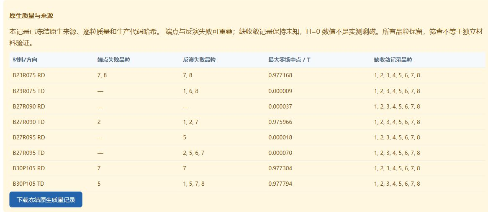

# 原生质量进入工作台与出口（2026-10-05，CPU）

用户的 GPU 暂停限制继续有效。本轮只读取既有 table、校准 bank 和官方结果，未启动 MuMax、GPU 训练或 Maxwell。工作台恢复为 `http://127.0.0.1:5001/workbench`，使用 `--cpu-only`：可标定、预测、准备隔离任务和整理结果，求解/训练/队列恢复提交返回 HTTP 423；启动时不自动续跑队列。其他应用和原目录保留。

## 新增行为

`native_quality_contract_v1` 重新核对实际 manifest、取向、脚本、成功状态与 table 字节，按 RD/TD 保留全部晶粒，记录端点、分支反演、未约束 H0 和残余 torque。还检查原生对的材料参数、厚度、H 轴和 table 聚合，避免曲线改动后继续继承旧审计。来源 hash 与生产代码 hash 随记录冻结；未知 torque 不判通过。

现有 64 粒仍为 5 粒端点筛查失败、18 粒反演失败（可重叠）、64 粒 torque 未知。四个材料均不能仅凭当前原生证据获得正式训练标签资格。数值筛查不认证真实材料，H0 数值也不是实测 Br；没有删粒或扣除偏移。

页面现在显示各样品摘要和八组逐方向晶粒表，并可下载本次冻结质量记录。旧校准记录没有质量文件时，页面明确显示“现存源数据复查”，不改写旧记录。新校准包包含 `native_quality.json`；预测 JSON、`.amat` 注释和 metadata 继承输入来源状态。留出材料出口区分目标原生质量与其余训练材料的质量哈希。

上传的“通过”标签不会直接被接受。输入必须与已保存的材料对逐字段匹配，才重新核对其 native 来源；修改曲线/参数或外部新材料仍标记未审计。其他材料修正和试验 B-H 导出可用，但不能据此认定新增批次验证完成。

正式固定 H 代理训练合同现在拒绝缺少质量字段、筛查失败、未知收敛及未获准的诊断标签。要求 `native_quality_contract_version`、`native_quality_status`、64 位 `native_quality_sha256` 和 `strict_training_eligible`；格式检查不是对任意 CSV 真实性的认证，实际来源核验由原生审计完成。旧 legacy 数据合同保留，但本轮不训练、不重建旧代理。

质量注释没有进入模型选参或训练材料身份。旧默认 samples 数值结构保留，带质量的网页/新报告显式请求审计字段。原 v2 bank、八条留出曲线和选参都保持：平均 RMSE 0.04404265 T、最坏 B800 0.10615669 T，尚未全达标。`.amat` 的 RD/TD Points 与未附审计时逐字一致；铁损仍是未校准零占位，ND 仍为未测量先验。



## CPU 复现和资源控制

公开证据 `calibration/workbench_quality_20261005` 对应主工作区 `calibration/diagnostics/workbench_quality_20261005/release_final`。开发过程的早期快照只保留在主工作区，公开限定同步最终证据。

```powershell
python tools/start_workbench.py --port 5001 --cpu-only
python tools/audit_workbench_native_quality.py --root . --output-dir calibration/new_workbench_quality_audit
python -m unittest discover -s tests -v
```

主工作区从根目录用 `.runtime/magsim/Scripts/python.exe -X utf8 magsim/tools/audit_workbench_native_quality.py --root . --output-dir calibration/diagnostics/new_workbench_quality_audit`。输出必须为新目录，不覆盖 pilot 或既有审计。

`native_quality.json`、`grain_quality.csv` 保存质量来源；`curve_identity.json` 验证已冻结全 bank/外层 bank 的曲线未变；`source_integrity.json` 核对 525 个 pilot 和 26 个冻结校准文件；九个界面/合同生产文件另附原始字节副本。本轮新 GPU/原生执行为 0，累计 MuMax/Maxwell 仍 668/4。

主工作区 100 项测试通过，新增十项覆盖来源/聚合与 hash 变化、未知 torque、拒绝上传的假通过标签、模型/完整材料留出保持、导出 Points 与双方向质量一致、正式训练入口拒绝、CPU HTTP 防护及启动不恢复队列。77 个 tracked/new 源码 AST 和网页 JS 语法检查通过。网页完成新记录 `cal_00fb5752f67f`、B30P105 预测 `pred_c960dad289ac` 和质量 JSON 下载的真实操作；质量警示与出口相符。

网页另准备双材料任务 `scan_87b9967c56b4`，仍为 prepared、0/2，提交/恢复按钮禁用。此为隔离模板/材料副本准备，未执行求解，也不算新的电机证据。旧四任务仍保持 completed_with_failures，周期相位差门限没有放宽。

下一步继续 CPU 范围：分析旧官方 CSV 的相位波形差，整理与校准质量一致的材料/训练来源接口。真正恢复原生状态对照或新电机求解仍需用户明确允许；定时器、许可可连接或 GPU 空闲均不是恢复授权。
